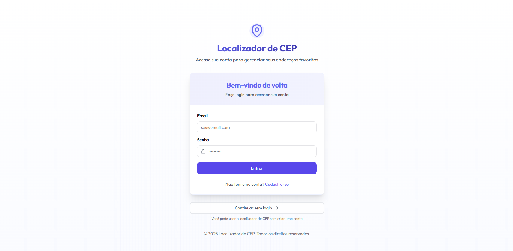
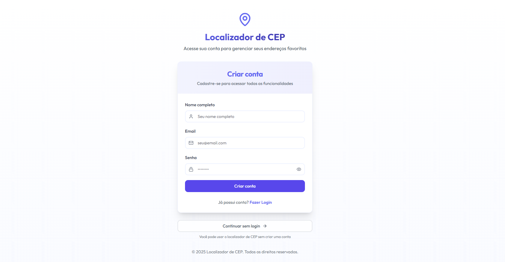
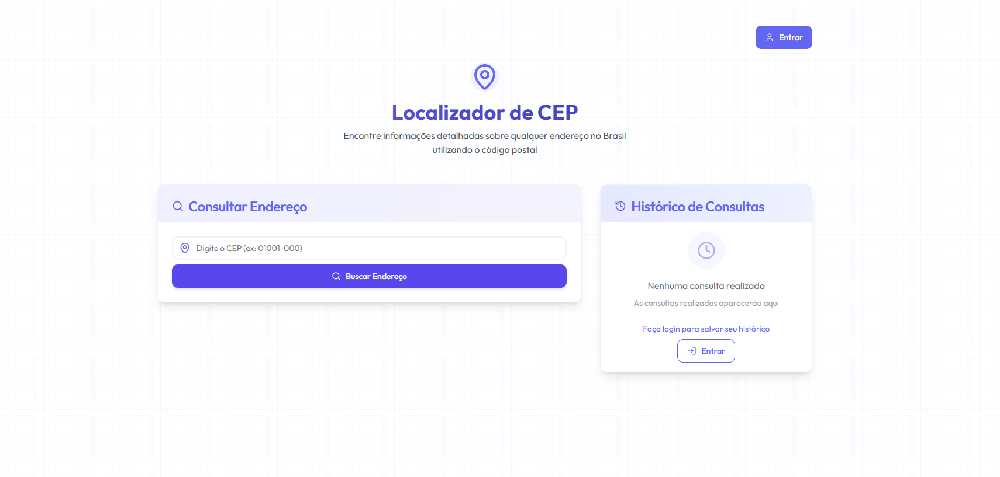
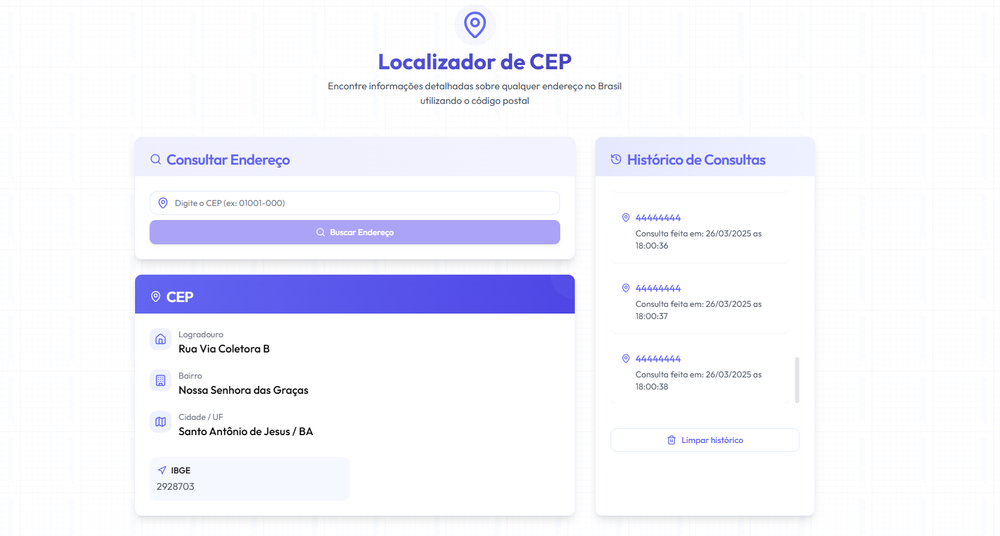

# 📦 CEP App

Bem-vindo ao **CEP App**! Um aplicativo para consultar endereços a partir de CEPs brasileiros de forma rápida e fácil.

## 🚀 Funcionalidades

- **Consulta de Endereços**: Insira um CEP e obtenha informações detalhadas.
- **Histórico de Consultas**: Acompanhe todos os CEPs consultados.
- **Autenticação de Usuário**: Crie uma conta e faça login.
- **Interface Intuitiva**: Navegação fácil e design responsivo.

## 🛠️ Tecnologias Utilizadas

- **Frontend**: React, Next.js, Tailwind CSS
- **Backend**: Node.js, Express, Sequelize
- **Banco de Dados**: PostgreSQL
- **Autenticação**: JSON Web Tokens (JWT)
- **Docker**: Para configuração e execução do ambiente

## 📸 Capturas de Tela

### Tela de Login


### Tela de Registro


### Tela de Consulta


### Histórico de Consultas


## 📦 Como Executar o Projeto

### Pré-requisitos

- Docker
- Docker Compose
- Node.js
- npm ou yarn

### Passos para Instalação

1. Clone o repositório:
   ```bash
   git clone https://github.com/seu-usuario/cep-app.git
   ```

2. Navegue até o diretório do projeto:
   ```bash
   cd cep-app
   ```

3. Configure as variáveis de ambiente no arquivo `.env`:
   ```plaintext
   POSTGRES_USER=seu_usuario
   POSTGRES_PASSWORD=sua_senha
   POSTGRES_DB=cep_db
   JWT_SECRET=sua_chave_secreta
   API_URL=sua_url_de_api
   CEP_EXTERNAL_URL_API=api_externa_via_cep
   HASH_CRYPTO_SECRET=segredo_para_crypto
   PORT=porta_backend
   ```

4. Inicie os serviços com Docker Compose:
   ```bash
   docker-compose up -d
   ```

5. Instale as dependências do backend:
   ```bash
   cd backend
   npm install
   ```

6. Instale as dependências do frontend:
   ```bash
   cd ../frontend
   npm install
   ```

7. Inicie o aplicativo:
   ```bash
   cd ..
   npm run dev
   ```

8. Acesse o front-end em `http://localhost:3000`.

9. Acesse o back-end em `http://localhost:3001` ou na porta informada na `.env`.

## 🤝 Contribuições

Contribuições são bem-vindas! Siga estas etapas:

1. Fork o projeto.
2. Crie uma nova branch.
3. Faça suas alterações e commit.
4. Envie para o branch original.
5. Crie um novo Pull Request.

---

Esperamos que você goste do **CEP App**! Dúvidas ou sugestões, entre em contato.